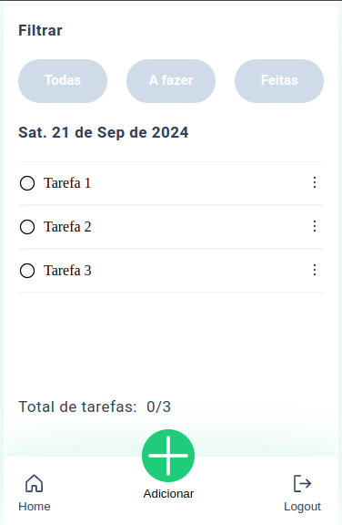

# Desafio Stalo Digital - TODO List

O projeto *Todo List* é sistema desenvolvido em ReactJS e Typescript que permite criar usuários, realizar login e gerenciar a criação de tarefas. Esse projeto faz parte do desafio proposto pela **Stalo Digital**



## 🛠️ Tecnologias utilizadas

- **Typescript**
  - Linguagem de programação utilizada
- **ReactJS**
  - Biblioteca Frontend utilizada para a criação da inteface do sistema
- **React Router Dom**
  - Biblioteca utilizada para navegação entre paginas
- **HTML**
  - Linguagem de marcação utilizada para a criação da interface do sistema
- **CSS**
  - Criação da estilização dos componentes
- **Local Storage**
   - Utilizado para armazenamento dos usuários cadastrados no sistema

## 🚀 Funcionalidades desenvolvidas

Foi desenvolvido o CRUD (CREATE, READ, UPDATE, DELETE) para o gerenciamento de tarefas

- [x] Create Task   - Criar nova tarefa
- [x] Read Task     - Lista de todas as tarefas e também a visualização dos detalhes de uma dada tarefa
- [x] Update Task   - Atualização da descrição de uma data tarefa e também a opção de concluir uma dada tarefa
- [x] Delete Task   - Deletar uma data tarefa da lista de tarefas
- [x] Count Task    - Contagem de todas as tarefas cadastradas
- [x] Create User   - Criar um novo usuário no sistema
- [x] Login User    - Validação do email e senha do usuário cadastrado

## 🛠️ Pré-requisitos

Antes de iniciar o sistema, verifique se você possui a seguinte ferramenta instalada em sua máquina:

- NodeJS

## 🚀 Executando o Sistema

### Passo 1: Clonar o repositório

Comece clonando este repositório para sua máquina local. Abra o terminal e execute o seguinte comando:

```bash
git clone https://github.com/Rozangela-S/desafio-stalo-digital.git
```

Isso criará uma cópia local do repositório em seu ambiente

### Passo 2: Inicializando as dependências

Na pasta todolist-front execute o seguinte comando para baixar as dependências do projeto

```bash
npm install
```

### Passo 3: Inicializando o projeto

Na raiz da pasta **todolist-front**

```bash
npm run dev
```

A aplicação irá ser execuatdo em: **http://localhost:5173**
